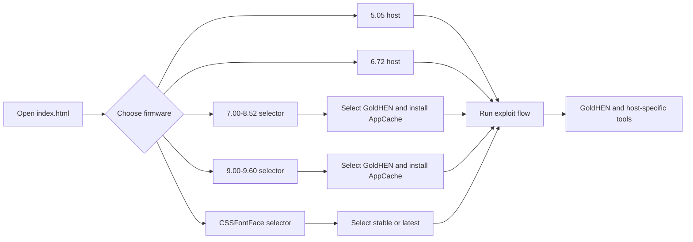

<strong>PlayStation Exploit Collection</strong>

  <strong>Offline-first PS4 host hub with firmware-specific exploit flows and GoldHEN and HEN integration.</strong>

  
  
  
  

<!-- Replace the placeholder below with the raw GitHub URL of assets/showcase.webp after uploading the repository. -->

PlayStation Webkit is a self-contained collection of static PS4 host pages. It provides one entry point for choosing a console firmware, then routes to the corresponding exploit and GoldHEN or HEN flow. The project is designed for local hosting, offline caching, and use in the PS4 browser.

> This project is intended for educational, preservation, and research purposes. Use it at your own risk. It is not affiliated with or endorsed by Sony Interactive Entertainment.

<strong>Contents</strong>

- [What this project provides](#what-this-project-provides)
- [Supported firmware flows](#supported-firmware-flows)
- [How the host works](#how-the-host-works)
- [GoldHEN versions](#goldhen-versions)
- [Payload tools](#payload-tools)
- [Offline caching](#offline-caching)
- [Using the host](#using-the-host)
- [Technical design](#technical-design)
- [Troubleshooting](#troubleshooting)
- [Safety and limitations](#safety-and-limitations)
- [Credits and attribution](#credits-and-attribution)

## What this project provides

- A unified root firmware selector at [`index.html`](./index.html).
- Dedicated offline host pages for PS4 firmware 5.05 and 6.72.
- PSFree/Lapse host flows for firmware 7.00–8.52 and 9.00–9.60.
- A CSSFontFace UAF host flow for firmware 6.00–11.02.
- A Slopkit port host for firmware 11.00-13.00 and 13.02-13.52.
- GoldHEN v2.4b18.12, v2.4b18.11, v2.4b18.10, v2.4b18.9 and v2.4b18.5 selection where the host supports both builds.
- HEN 2.2.0 Beta selection on the latest jailbreakable firmwares
- AppCache-based offline operation with firmware-specific cache and manifest files.
- Firmware-specific payload utilities on the host branches that provide them.
- A consistent terminal, cyberpunk, and retro-computing visual system across selectors, cache pages, and exploit pages.
- Responsive layouts and keyboard/controller-friendly focus states for browser navigation.

## Supported firmware flows

| Firmware | Entry point | Exploit flow | GoldHEN or HEN selection | Utility payloads |
|---|---|---|---|---|
| **5.05** | `505/index.html` | Dedicated firmware-specific host | Directly on the host page | Included |
| **6.72** | `672/index.html` | Dedicated firmware-specific host | Directly on the host page | Included |
| **7.00–8.52** | `700/version-selector.html` | PSFree + Lapse host flow | Version selector, then offline cache page | Included |
| **9.00–9.60** | `900/version-selector.html` | PSFree + Lapse host flow | Version selector, then offline cache page | Included |
| **6.00–11.02** | `css/version-selector.html` | CSSFontFace UAF + Lapse/Poops | Version selector, then `stable` or `latest` host | No separate utility-payload menu |
| **11.00–13.00** | `slopkit/version-selector.html` | Slopkit UAF + Lapse/Poops | Version selector, then `stable` or `previous` host | No separate utility-payload menu |
| **13.02–13.52** | `relapse/version-selector.html` | Slopkit Relapse | Version selector, then `variation 1 hen` or `variation 2 goldhen` host | No separate utility-payload menu |

The root selector stores the selected firmware locally and routes to the correct branch. Always use the host intended for the exact firmware installed on the console.

## How the host works

The project is intentionally static. HTML pages provide the user interface, JavaScript modules run the firmware-specific exploit chain, binary files provide GoldHEN/HEN/kernel-patch/payload assets, and AppCache files keep the selected flow available after the initial cache installation.

## Homebrew Enablers versions

The repository contains three GoldHEN or HEN choices where supported:
- **HEN v2.2.0 Beta** — the open source HEN used to test the newly discovered jailbreak in latest firmwares.
- **GoldHEN v2.4b18.12** — the latest build that supports 13.02-13.50 firmwares no new features.
- **GoldHEN v2.4b18.11** — the latest build that supports 13.52 firmware no new features.
- **GoldHEN v2.4b18.10** — the previous latest build that supports up to 13.00 with auto load payload in utility.
- **GoldHEN v2.4b18.9** — the previous build that supports also supports up to 13.00
- **GoldHEN v2.4b18.5** — the stable/previous build for users who prefer the older version.

The 7.00–8.52 and 9.00–9.60 branches select a GoldHEN build through their version selector and cache page. The CSSFontFace branch uses [`css/version-selector.html`](./css/version-selector.html), which routes to:

- [`css/latest/index.html`](./css/latest/index.html) for v2.4b18.10;
- [`css/stable/index.html`](./css/stable/index.html) for v2.4b18.5.

## Payload tools

Payload availability is firmware-specific.

### Hosts with utility payloads

Depending on the selected branch, the host pages provide tools such as:

- FTP Server;
- PS4Debug;
- App2USB;
- Backup and Restore;
- Enable Updates and Disable Updates;
- AppCache Install;
- History Blocker;
- PUP Decrypt;
- RIF Renamer;
- PSFree Fix on the PSFree branches;
- WebRTE on the branches that include it;
- Kernel Clock on the firmware host that provides it.

The exact list differs between 5.05, 6.72, 7.00–8.52, and 9.00–9.60. Payload buttons load the selected binary through the host's existing payload loader and may require a compatible payload receiver on the same network.

### CSSFontFace host scope

The CSSFontFace branch deliberately excludes the standalone utility-payload menu used by the other host branches. The CSSFontFace exploit flow is memory-intensive by nature, so removing additional payload tools helps preserve the memory headroom needed for a more stable exploit and GoldHEN launch. Its interface is focused on:

- exploit output;
- Lapse or Poops chain selection;
- Auto Jailbreak countdown and manual `Jailbreak` activation;
- automatic loading of the selected GoldHEN build.

The CSSFontFace implementation still contains the internal binary stage required to complete its selected exploit/GoldHEN flow. That internal stage is not a user-selectable utility payload and is not equivalent to the optional utility-payload set excluded from this host.

### Slopkit host scope

The Slopkit branch deliberately excludes the standalone utility-payload menu used by the other host branches. The Slopkit exploit flow is memory-intensive by nature, so removing additional payload tools helps preserve the memory headroom needed for a more stable exploit and GoldHEN or HEN launch. Its interface is focused on:

- exploit output;
- Lapse or Poops chain selection;
- Auto Jailbreak countdown and manual `Jailbreak` activation;
- automatic loading of the selected GoldHEN or HEN build.

### Slopkit Relapse host scope

The Relapse branch deliberately excludes the standalone utility-payload menu used by the other host branches. The Slopkit Relapse exploit flow is memory-intensive by nature, so removing additional payload tools helps preserve the memory headroom needed for a more stable exploit and GoldHEN or HEN launch. Its interface is focused on:

- exploit output;
- homebrew enabler selection;
- Auto Jailbreak countdown and manual `Jailbreak` activation;
- automatic loading of the selected GoldHEN or HEN build.

## Offline caching

All host branches use relative assets and browser application caching. Cache files must be served from the paths expected by their entry pages; do not rename or flatten the firmware directories after deployment.

| Branch | Cache flow |
|---|---|
| **5.05** | `505/cache.manifest` is attached to the host page and the page reports installation progress. |
| **6.72** | `672/cache.manifest` is attached to the host page and the page reports installation progress. |
| **7.00–8.52** | Select a build in `700/version-selector.html`, then use `cache.html` or `cache5.html` to install `PSPulse.cache` or `PSPulse5.cache`. |
| **9.00–9.60** | Select a build in `900/version-selector.html`, then use `cache.html` or `cache5.html` to install `PSPulse.manifest` or `PSPulse5.manifest`. |
| **CSSFontFace** | Select a build in `css/version-selector.html`; the chosen `stable` or `latest` page uses its own `cache.manifest`. |
| **Slopkit** | Select a build in `slopkit/version-selector.html`; the choosen `latest` or `previous` page uses its own `cache.manifest`. |
| **Slopkit Relapse** | Select a build in `relapse/version-selector.html`; the choosen `variation 1` or `variation 2` page uses its own `cache.manifest`. |

After the first successful cache installation, close and reopen the PS4 browser when the page instructs you to do so. If a page still serves an older layout or script, clear the host's browser data and repeat the cache installation.

The repository also includes small generator scripts for rebuilding cache files after asset changes. Whenever a cached file changes, regenerate the corresponding manifest/cache and verify that every referenced relative path is available from the deployed host.

## Using the host

1. Serve the repository root through an HTTP or HTTPS static server. The PS4 browser should not be expected to run the complete flow from an unsupported `file://` URL.
2. Open the root [`index.html`](./index.html) in the PS4 browser.
3. Select the exact firmware range matching the console.
4. If the selected branch has a GoldHEN or HEN version selector, choose **Latest** or **Stable** or **Previous** or **Variation 1** or **Variation 2** and wait for the cache page to finish.
5. On the host page, wait for the ready/status message before starting the exploit.
6. After GoldHEN or HEN has loaded, use only the tools shown by that host branch.

For the CSSFontFace host, **Auto Jailbreak** is enabled by default and starts a five-second countdown. During the countdown you can select `Lapse`, switch Auto Jailbreak off, or allow the default flow to continue. With Auto Jailbreak disabled, press `Jailbreak` manually when the page is ready.

The CSSFontFace page stores the selected chain in `localStorage` under `exploitChain` and the Auto Jailbreak preference under `autoJb`. The root selector and GoldHEN selectors also keep their selected values locally so the browser can preserve the last choice between page loads.

## Technical design

### Root selector

The root page is a custom firmware dropdown rather than a collection of separate links. It supports pointer interaction and keyboard navigation, updates the selected option state, stores `selectedFirmware`, and routes to the matching host branch.

### PSFree/Lapse branches

The 7.00–8.52 and 9.00–9.60 branches include:

- firmware-specific PSFree exploit modules;
- Lapse exploit modules and firmware-specific ROP support;
- firmware-specific kernel patches;
- GoldHEN binaries for the two supported builds;
- AppCache/manifest-driven cache pages;
- payload loaders and host-specific utility binaries.

The 7.00–8.52 and 9.00–9.60 branches keep separate `latest` and `stable` asset variants so the selected GoldHEN build can be cached independently.

### CSSFontFace branch

The CSSFontFace implementation includes the CSSFontFace UAF userland path, shared memory/read-write/ROP helpers, Lapse and Poops exploit chains, PS4 kernel support, firmware-specific kernel patches, and a terminal-style status logger. The `stable` and `latest` directories are intentionally parallel so they can be cached and served independently.

The CSS control panel is kept small and predictable for the PS4 browser: exploit output, chain selection, Jailbreak, and Auto Jailbreak. The radio-chain focus styling uses the broadly supported `:focus` selector so controller navigation remains visibly highlighted on the older PS4 browser engine.

### Slopkit branch

The Slopkit implementation includes the Slopkit UAF userland path, shared memory/read-write/ROP helpers, Lapse and Poops exploit chain, PS4 kernel support, firmware-specific kernel patches, and a terminal-style status logger. The `stable` and `previous` directories are intentionally parallel so they can be cached and served independently.

The CSS control panel is kept small and predictable for the PS4 browser: exploit output, chain selection, Jailbreak, and Auto Jailbreak. The radio-chain focus styling uses the broadly supported `:focus` selector so controller navigation remains visibly highlighted on the older PS4 browser engine.

### Slopkit Relapse branch

The Slopkit Relapse implementation includes the Slopkit UAF userland path, shared memory/read-write/ROP helpers, Relapse exploit chain, PS4 kernel support, firmware-specific kernel patches, and a terminal-style status logger. The `variation 1` and `varation 2` directories are intentionally parallel so they can be cached and served independently.

The CSS control panel is kept small and predictable for the PS4 browser: exploit output, chain selection, Jailbreak, and Auto Jailbreak. The radio-chain focus styling uses the broadly supported `:focus` selector so controller navigation remains visibly highlighted on the older PS4 browser engine.

### AppCache maintenance

AppCache is legacy browser technology, but it is part of the host's offline delivery model. Treat cache files as generated artifacts: after changing an HTML, JavaScript, binary, or patch asset, update the matching cache list/hash and test the first-load and cached-load paths separately.

## Troubleshooting

### The wrong page or an old version is loading

Clear the PS4 browser's site data for the host, close and reopen the browser, then start from the root selector. Confirm that the selected branch's cache file contains the current relative asset paths.

### The cache never finishes

Make sure the repository is served over HTTP/HTTPS, the manifest has the correct MIME/configuration on the server, and every listed file is reachable at the exact relative path. A stale AppCache can survive normal refreshes; clear site data before retrying.

### The exploit does not complete

Verify the console firmware and selected branch, close unrelated browser tabs, and retry from a clean browser state. On the CSSFontFace and Slopkit page, try disabling Auto Jailbreak and start the flow manually with `Jailbreak`. Exploit reliability can vary with browser memory, cached state, and console conditions.

### The PS4 browser freezes

JavaScript cannot reliably recover a browser process that has stopped responding. Close and reopen the PS4 browser, then load the matching host again. Avoid adding repeated retry or reload loops; they can increase instability.

### A utility payload does not respond

Wait until the host reports that the exploit/GoldHEN or HEN flow is ready. Confirm that the selected host actually provides the requested utility, that the PS4 and payload receiver are on the expected network, and that the receiver is listening on the required port. The CSSFontFace and Slopkit branch does not provide standalone utility-payload buttons.

## Safety and limitations

- Use only the host intended for the console's exact firmware.
- Do not interrupt the console while an exploit, GoldHEN or HEN load, payload, or system operation is running.
- Keep a safe recovery path and current backups before using backup, restore, or system-related utilities.
- Do not use exploit pages for PSN access or other online services.
- Do not assume that a payload is harmless simply because it is bundled locally; review what each utility does before loading it.
- The CSSFontFace and Slopkit flow is especially sensitive to available browser memory; excluding optional utility payloads is an intentional stability trade-off.
- No host can guarantee identical results on every console, browser build, cache state, or network configuration.
---

  PlayStation Webkit · Offline PS4 Host Collection

